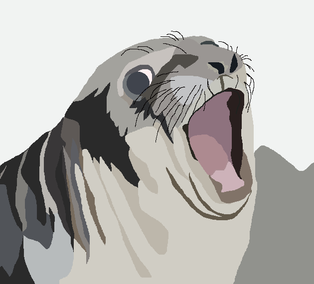

<!DOCTYPE html>
<html lang="en">
<head>
    <title>toupy's portfolio</title> <!--the tab is now this, the head is used for everything behide the website-->
</head>

<body>
    <h1><u>Hi</u></h1>
    <h2>This is a <b>test</b>, ignore this stuff bro</h2>
    
    
Eat 🐱

    

        <table border="5">
            <tr>
                <th>This is a table but bold</th>
                <th>yipeee</th>
            </tr>
            <tr>
                <td>This is a table but not bold</td>
                <td>eggs</td>
            </tr>
            <tr>
                <td>This is very cool</td>
                <td>im kinda bored</td>
            </tr>
        </table>
    

</body>
</html>

<!-- hi potato this is a comment-->
